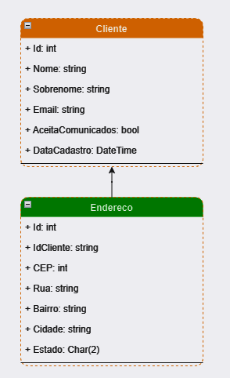
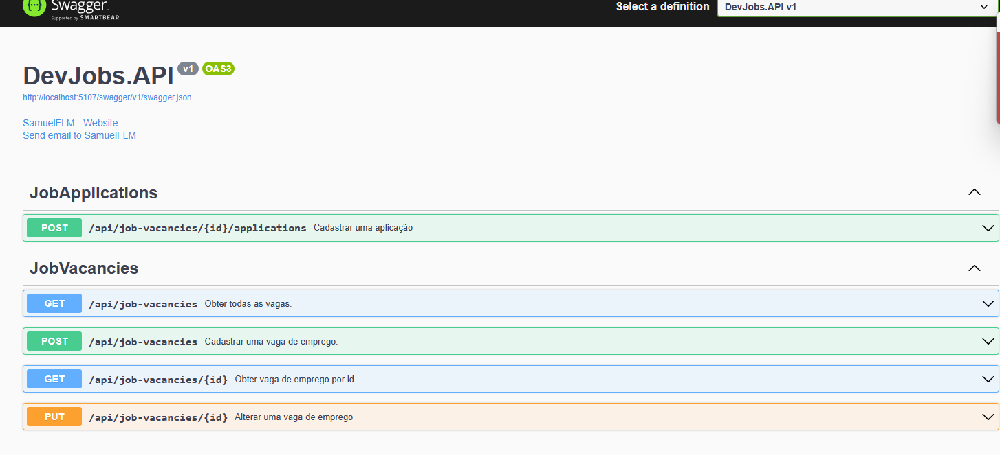

# .NET - API REST e Entity Framework

## **Desafio de projeto**

**Aplicação responsavel por gerenciar pessoas**

**Contém as seguintes funcionalidades: **

**Buscar,cadastrar,editar, deletar e exibir detalhes de uma pessoa.  **

**Será Desevolvida uma API REST completa.  **
**Linguagem C# e framework .NET 7  **
**Padrão repository com entity framework Core para acesso a dados. **
**Clean code, logs com serilog, documentação de API's com swagger. **

## **Estrutura**

## **Swagger**

